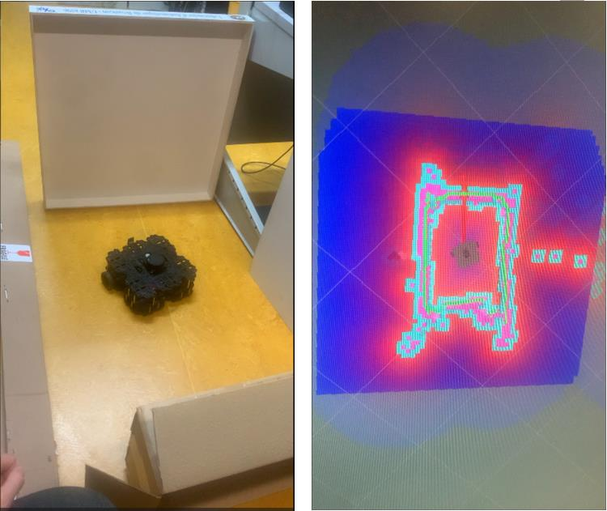

# Description brève du projet :

 L’objectif de notre projet est d’apprendre `a conduire un robot mobile `a l’aide de ros, et d’utiliser et d’analyser le syst`eme de positionnement et de navigation existant du robot.Enfin nous collecterons les donn´ees du capteur transport´ees par le robot mobile turtlebot3 et de fusionner plusieurs donn´ees pour obtenir une meilleure estimation de l’attitude du robot et un meilleur effet de positionnement. Le logiciel et le mat´eriel utilis´es dans le projet sont les suivants: 1.Robot mobile `a deux roues turtlebot3 waffle pi 2.capteur utilis´e(360 Laser Distance Sensor LDS-01,IMU:Gyroscope 3 Axis Accelerometer 3 Axis,Position sensor:Contactless absolute encoder 12Bit) 3.un syst`eme d’exploitation sous Linux version Ubuntu 18.04 avec aussi ROS kinetic (Robot Operating System). Dans ce rapport, nous d´etaillerons chaque composant du projet, mat´eriel ou logiciel, ainsi que la raison, le methode et les techniques utilis´ees pour faire ce travail.  

