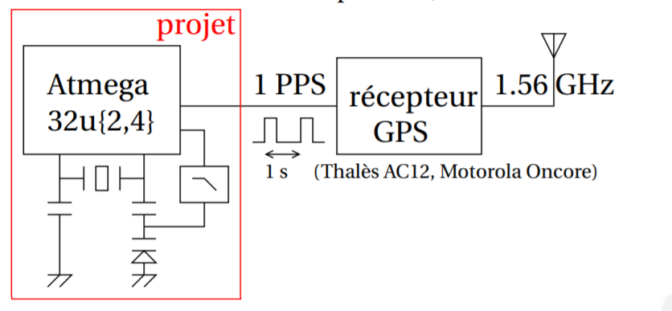

# Description brève du projet :

 Une source stable de temps est issue du GPS, une constellation de satellites munis d’horloges atomiques transmettant un signal permettant de remonter au temps de vol de l’onde électromagnétique émise par chaque satellite et, connaissant leur position, remonter de façon précise à la source de fréquence transmise par chaque satellite. Une forme particulièrement appropriée à notre objectif est l’émission d’une impulsion chaque seconde (1 PPS – 1 pulse par seconde) avec un front précis à quelques dizaines de nanosecondes près. De nombreux récepteurs GPS propose cette fonctionnalité. En mesurant le nombre d’oscillations du quartz cadençant le microcontrôleur entre deux impulsions, nous serons capables de mesurer précisément la fréquence du quartz. La condition de rotation de phase pour réaliser un oscillateur (multiple de 2π dans la boucle d’oscillation) est vérifiée grâce aux condensateurs placés de part et d’autre du dipôle formé par le résonateur à quartz. En ajustant un de ces condensateurs, nous pouvons décaler la fréquence d’oscillation du circuit et ainsi asservir sa fréquence sur le 1 PPS afin de garantir une période indépendante de la température ou des conditions environnementales du microcontrôleur. Alternativement, cette stratégie permet de réaliser d’excellents capteurs grâce aux excellentes références que sont les horloges atomiques dont la stabilité est en partie transposée sur les récepteurs GPS au sol.
L’oscillateur à quartz que nous allons asservir sera instable, le but du jeu est de mettre un correcteur pour le rendre stable. : 

La figure ci-dessous représente le schéma récapitulatif de notre projet:

